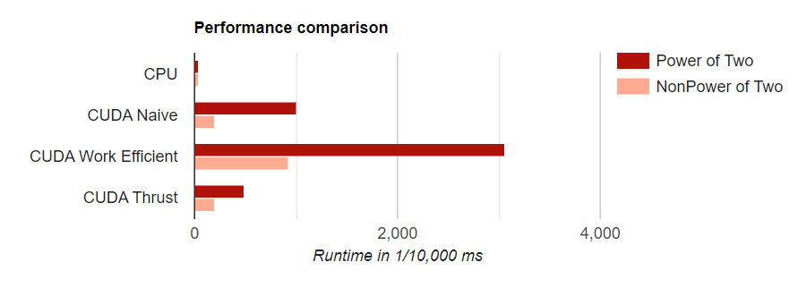
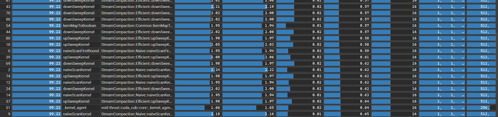
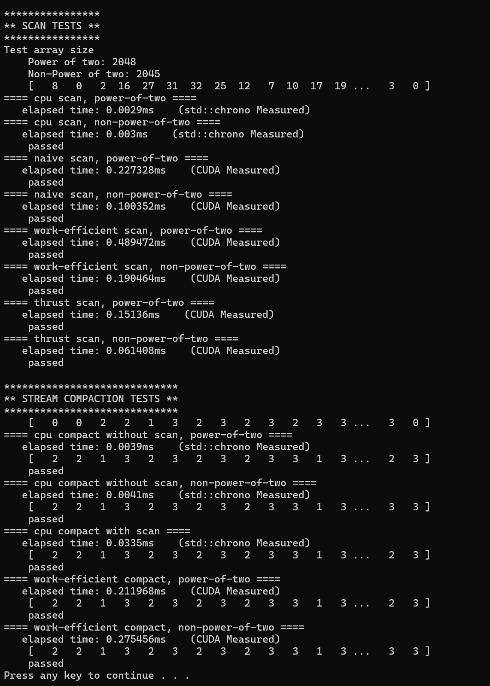
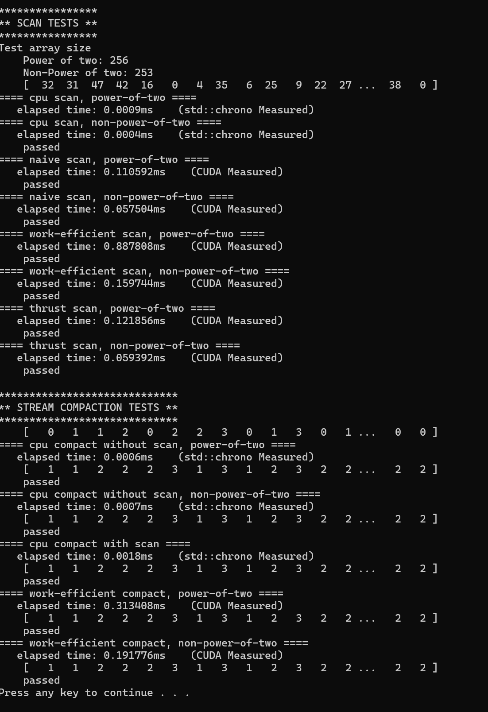
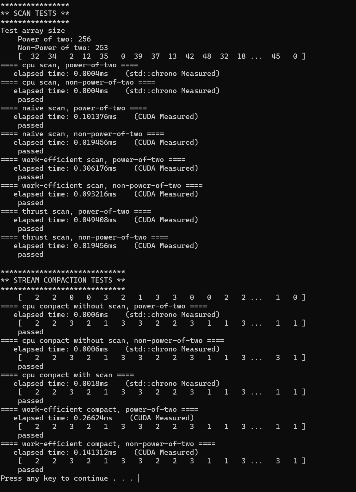
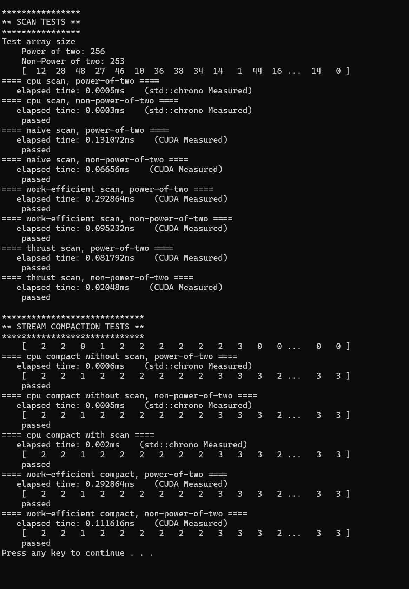

CUDA Stream Compaction
======================

**University of Pennsylvania, CIS 565: GPU Programming and Architecture, Project 2**

* Jiahang Mao
  * [LinkedIn](https://www.linkedin.com/in/jay-jiahang-m-b05608192/)
* Tested on: Windows 11, i5-13600kf @ 5.0GHz 64GB, RTX 4090 24GB, Personal Computer

### Project Features
* CPU implementations:
  * Simple sequential scan
  * Stream compaction without scan
  * Stream compaction with scan
* GPU implementations:
  * Naive parallel scan
  * Work-efficient parallel scan
  * Thrust library-based scan
  * Work-efficient stream compaction
  * Performance timing for both CPU and GPU implementations
* Support for both power-of-two and non-power-of-two input sizes

### Questions

* Roughly optimize the block sizes of each of your implementations for minimal
  run time on your GPU.
  
  With array size set to 256. I have tried block size to 256, 512 ,1024. Of which 512 block size showed best results on all cuda-enabled functions. Showing anywhere from 10% ( Naive po2) to nearly 250% (work efficient po2) improvement over blocksize == 256. 1024 Block size showed results on par with 512.

* Compare all of these GPU Scan implementations (Naive, Work-Efficient, and
  Thrust) to the serial CPU version of Scan. Plot a graph of the comparison
  (with array size on the independent axis).
   

* Write a brief explanation of the phenomena you see here.
  * CUDA Work Eficient being not efficient
    The most obvious surprising result is that the supposedly work efficient is significantly slower than Naive or thrust. Diving into the profiler it seems to be due to too many kernel invokations. Both upsweep and downsweep have similar computation and memory throughput to naive kernels, but consistig twice the kernel invokations greatly hinder the performance. The gap could be narrowed with much larger array size.
  
  *  Thrust implementation 
    
    The memory throughput is between single naive kernel and work efficient up/down sweep kernel. It invoked the block size that match the input ( 256 in this case). The primary performance jump should come from a single kernel call and reduced back and forth communication with main thread.

* Paste the output of the test program into a triple-backtick block in your
  README.

    Config: Block size 256, Test Array size 2048 

    

    Config: Block size 256, Test Array size 256

    

    Config: Block size 512, Test Array size 256

    

    Config: Block size 1024, Test Array size 256

     

